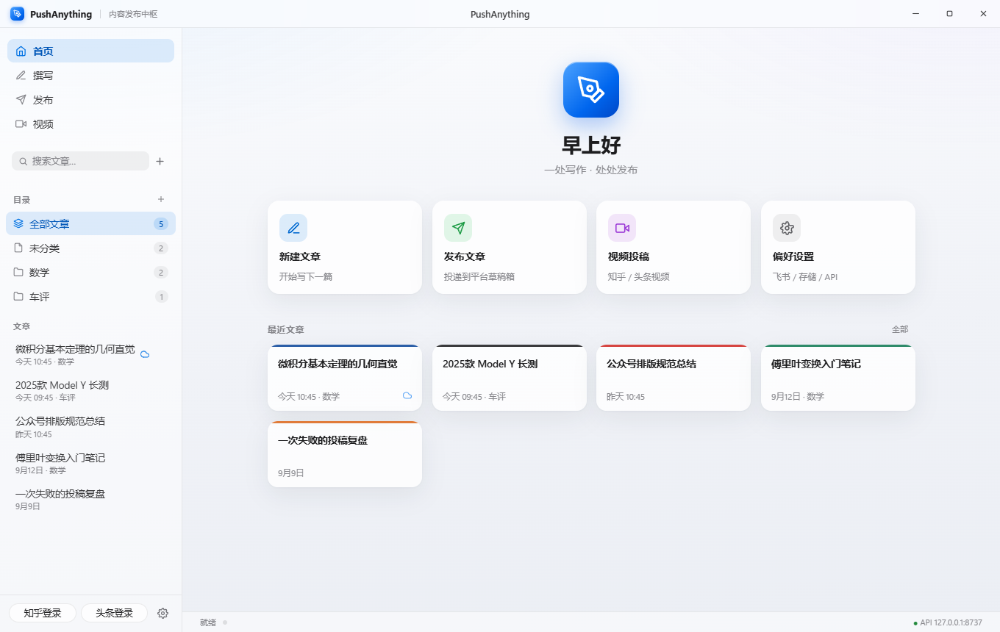
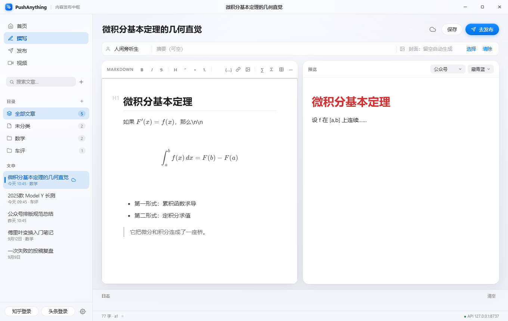
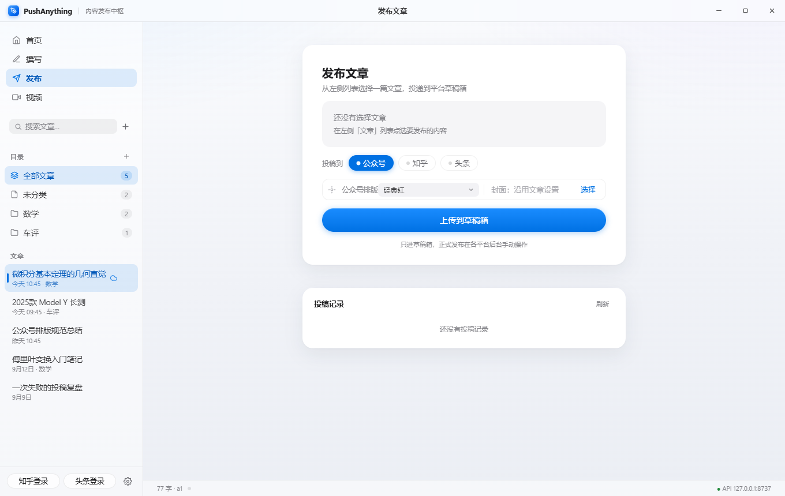

<div align="center">
  
  <h1>PushAnything</h1>
  <p><b>一处写作 · 处处发布</b></p>
  <p>Markdown 写一次，一键投递到 <b>公众号 / 知乎 / 头条</b> 草稿箱；也支持<b>视频投稿</b>与<b>飞书备份</b>。<br>
  只进草稿箱，正式发布永远由你自己点。</p>
  <p>
    
    
    
  </p>
</div>

---

## 功能一览

| | |
|---|---|
| 📝 **Typora 式编辑器** | IR 即时渲染、快捷键、选中文字智能包裹、URL 粘贴成链、剪贴板图片自动落盘、大纲导航、15s 自动保存 |
| ∑ **数学公式** | KaTeX 即时渲染；发布时转高清 PNG 走图片管道（本地 mathtext，断网可用） |
| 🎨 **公众号排版主题** | 经典红 / 藏青蓝 / 松绿 / 暖橙 / 墨黑，随文章保存，上传时生效 |
| 🗂 **目录管理** | 文件夹、搜索、右键菜单、移动归档 |
| 📤 **多平台投递** | 公众号走官方草稿 API；知乎/头条走 Edge 自动化（登录态持久化） |
| 🎬 **视频投稿** | 知乎 / 头条视频草稿，独立页面与任务队列 |
| ☁️ **飞书备份** | 保存即同步为飞书云文档，自动清理旧版本 |
| 📜 **投稿记录** | B 站稿件管理式历史列表，逐平台结果徽标，`history.json` 重启不丢 |
| 🔌 **本地 API** | `http://127.0.0.1:8737/api`，其他软件/脚本可直接投递任务 |
| 📱 **手机端** | 同一 WiFi 下手机扫码打开网页，写稿/选稿/看任务进度，投稿由电脑执行 |
| 💾 **自定义数据目录** | 所有本地数据可整体迁移到任意位置 |

## 截图

<p align="center">
  
  
  
</p>

## 安装

去 [Releases](../../releases) 下载最新版：

- **安装版**（推荐）：`PushAnything_Setup_x.x.x.exe` —— 装到 `%LOCALAPPDATA%\Programs\PushAnything`，
  开始菜单/桌面快捷方式 + 卸载程序，无需管理员权限
- **绿色版**：`PushAnything.exe` —— 放任意目录双击即用，数据存 exe 同级目录

## 快速开始

1. **登录一次**：侧栏底部「知乎登录」「头条登录」→ 弹出的 Edge 窗口里扫码/密码登录，
   登录态存在 `profiles\` 目录长期有效。公众号走官方 API，无需登录
2. **公众号凭证**：设置 →「公众号」→ 选择凭证 JSON（含 `mp_appid` / `mp_appsecret` 字段，
   在公众号后台 → 设置与开发 → 基本配置中获取；需开启「草稿箱」相关接口权限）
3. **写作**：撰写页直接写，标题必填；选目录、配主题、贴封面（留空自动生成渐变封面）
4. **投递**：点「去发布」→ 勾选平台 →「上传到草稿箱」，日志区看实时进度

## 页面

侧栏导航分四个页面：

- **首页**：问候语 + 快捷操作 + 最近文章卡片墙（卡片色条跟随排版主题），点卡片直接续写
- **撰写**：纯写作环境——标题、作者/摘要/封面、编辑器 + 平台实时预览、日志
- **发布**：选文章 → 平台胶囊 → 上传；下方是投稿记录面板，点条目展开完整日志
- **视频**：视频选择卡 + 标题/简介/封面 → 知乎/头条；侧栏切换为「最近任务」

## 编辑器细节（Typora 手感）

- 快捷键：`Ctrl+B` 加粗 · `Ctrl+I` 斜体 · `Ctrl+K` 链接 · `Ctrl+E` 行内代码 ·
  `Ctrl+Shift+K` 代码块 · `Ctrl+Shift+M` 行内公式 · `Ctrl+T` 表格 · `Alt+Shift+5` 删除线 · `Ctrl+S` 保存
- 选中文字敲 `*` `_` `` ` `` `~` `$` 直接包裹；选中文字后粘贴网址自动生成 `[文字](网址)`
- 剪贴板图片 `Ctrl+V` 自动存到文章 `assets/` 目录并插入相对路径
- 工具栏末尾 ☰ 弹出标题大纲，点击跳转
- 支持 `==高亮==`、脚注 `[^1]`、`[TOC]`、中英文自动空格

## 数学公式

- 行内 `$E=mc^2$`，独立成段 `$$ \int_0^1 x^2\,dx = \frac{1}{3} $$`
- 编辑器内 KaTeX 即时渲染（**本地资产，离线可用**）
- 发布时：公式转 220dpi 透明 PNG 走图片管道——本地 **matplotlib mathtext** 渲染（断网可用），
  复杂语法（`\begin{aligned}` 等）自动降级到 codecogs 在线渲染，再兜底源码文本，永不空白
- 飞书备份保留 LaTeX 源码，可在飞书文档中手动转为公式块

## 图片与表格

- 图片：`` 本地图 或 `` 网络图
  - 公众号：自动上传为微信素材；知乎/头条：模拟编辑器上传按钮按位置插入
- 表格：三平台统一渲染成图片插入（富文本编辑器粘贴表格必乱）

## 飞书备份

保存文章时自动同步为飞书云文档（官方 Markdown 导入接口，排版完整保留），或点工具栏 ☁ 手动备份。
已备份文章带云标记，右键可「在飞书中打开」；重复备份自动替换旧文档。

**一次性配置（约 5 分钟）**：

1. [open.feishu.cn](https://open.feishu.cn) → 开发者后台 → 创建**企业自建应用**，拿到 `App ID` / `App Secret`
2. 权限管理 → 开通 `docx:document`、`drive:drive`、`drive:file`、`docs:doc`、导入云文档
3. 版本管理与发布 → 创建版本并发布
4. 飞书客户端建文件夹 → 把应用加为**可编辑**协作者 → 文件夹 URL 最后一段是 Token
5. 三项填进设置页 →「测试连接」→ 勾选「保存文章时自动备份」

## 本地 API

软件运行时自动启动 `http://127.0.0.1:8737/api`（仅本机）。
设置里可改端口/关闭/设 `api_token`（设置后请求需带 `X-Token` 头）。
也可无窗口纯服务运行：`PushAnything.exe --serve`

```
GET  /api              接口说明          GET  /api/tasks/{id}  任务详情
GET  /api/health       存活检查
GET  /api/tasks        最近任务列表
GET  /api/articles     已保存文章列表（手机端用）
GET  /m                手机端页面（不鉴权）

POST /api/article      图文投稿
  { "title": "标题", "md": "# 正文",                 // 必填
    "author": "", "digest": "", "cover_path": "",     // 可选
    "style": "blue",                                  // 可选，公众号主题
    "platforms": ["wechat","zhihu","toutiao"],
    "wait": true }                                    // 同步等结果

POST /api/video        视频投稿
  { "title": "", "video_path": "D:\\a.mp4",           // 必填
    "desc": "", "cover_path": "",                     // 可选
    "platforms": ["toutiao","zhihu"], "wait": true }

POST /api/feishu       飞书云文档备份
  { "title": "", "md": "", "slug": "", "wait": true }
```

```bash
curl -X POST http://127.0.0.1:8737/api/article ^
  -H "Content-Type: application/json" ^
  -d "{\"title\":\"测试\",\"md\":\"## 你好\",\"platforms\":[\"wechat\"],\"wait\":true}"
```

## 手机端

手机不需要装任何 App——电脑上的 API 服务同时提供一个局域网网页：

1. 电脑和手机连**同一 WiFi**
2. 打开 PushAnything → 设置 →「手机端」→ **扫二维码**（或手动输入显示的网址 `http://电脑IP:端口/m`）
3. 首次连接 Windows 可能弹防火墙提示，选"允许专用网络"
4. 设置了 `api_token` 的话，手机端首次打开填一次 Token（会记住）

手机端三个页签：

- **写稿**：标题 + Markdown 正文 + 作者/摘要，选平台直接投递
- **选稿**：列出电脑上已保存的文章，点选后一键投递
- **任务**：实时任务进度（5 秒自动刷新），点任务可展开日志

所有投稿实际由电脑端的浏览器执行，手机只是个遥控器——所以**电脑必须开着 PushAnything**。
不想让局域网访问时，在设置里取消勾选「允许局域网访问」即可（重启生效）。

## 窗口操作

无边框窗口：标题栏可拖动、双击最大化；**拖任意边缘/角落自由缩放**（最小 560×420）；
**右键标题栏**弹出贴边菜单——左半屏 / 右半屏 / 上半屏 / 最大化。

## 数据目录

| 目录/文件 | 内容 |
|---|---|
| `drafts\` | 文章（`.md` + `.json` 元信息 + `assets\` 粘贴图），支持子文件夹 |
| `profiles\` | 知乎/头条浏览器登录态，删除即退出 |
| `assets\` | 生成的封面、截图 |
| `history.json` | 投稿记录（上限 200 条） |
| `config.json` | 配置（固定在 exe 旁，内含数据目录指针） |
| `crash.log` | 崩溃日志 |

> 设置 →「数据存储」可把上面所有数据整体迁到任意目录（自动迁移，重启生效）。

## 开发

```bat
:: 环境
python -m venv venv
venv\Scripts\python.exe -m pip install -r requirements.txt

:: 绿色 exe
build.bat

:: 绿色 exe + 安装包（需 Inno Setup 6）
build_installer.bat

:: 重新生成应用图标
venv\Scripts\python.exe make_icon.py
```

推 `v*` 标签触发 GitHub Actions：自动构建 exe + 安装包并创建 Release。

### 结构

```
app/
  main.py          入口（pywebview 窗口）
  backend.py       前后端桥（JS API）
  api_server.py    本地 HTTP API
  jobs.py          统一任务队列（UI 与 API 共用）
  runner.py        任务分发：article / video / feishu → 各平台 handler
  mdconvert.py     Markdown → 各平台 HTML（含公式/表格/主题渲染）
  wechat_push.py   公众号官方草稿 API
  zhihu_push.py    知乎浏览器自动化     zhihu_video.py   知乎视频
  toutiao_push.py  头条浏览器自动化     toutiao_video.py 头条视频
  feishu_sync.py   飞书云文档备份
  web/             前端（Vditor IR + KaTeX，全部本地化离线可用）
```

新增内容类型/平台：在 `runner.py` `register(kind, fn)` 一行接入，队列/日志/历史/API 自动继承。

## 已知说明

- 知乎/头条无官方草稿接口，靠浏览器自动化；平台改版可能导致选择器失效，
  需更新 `*_push.py` / `*_video.py` 顶部的选择器列表
- 上传时弹出的 Edge 窗口不要手动关闭；出现验证码手动过一下即可
- 找不到「存草稿」入口的平台会填好内容后保留窗口，由你手动点发布
- exe 约 90MB（内置 Python + Playwright + matplotlib），首次启动需解压几秒

## License

[MIT](LICENSE) © PushAnything contributors
